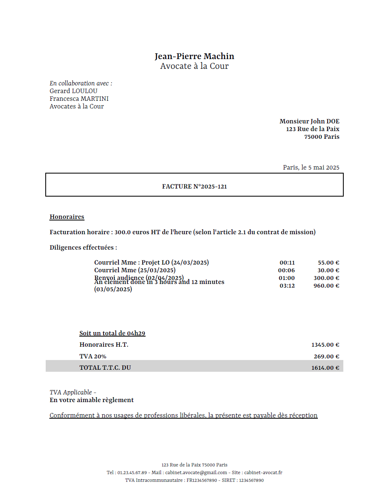

# Invoice Generation Project

This project generates PDF invoices using Python and ReportLab.

## Project Management

This project uses **uv** as the package manager and virtual environment manager.

## Setup

1.  **Ensure uv is installed:** If you haven't already, install uv following the instructions on the [official uv website](https://github.com/astral-sh/uv).
2.  **Sync dependencies:** Navigate to the project root directory in your terminal and run the following command to install the required packages into a virtual environment:
    ```bash
    uv sync
    ```

## Running the Script

To generate the sample invoice (`invoice.pdf`), run the following command from the project root:

```bash
uv run python main.py
```

## Example Output


